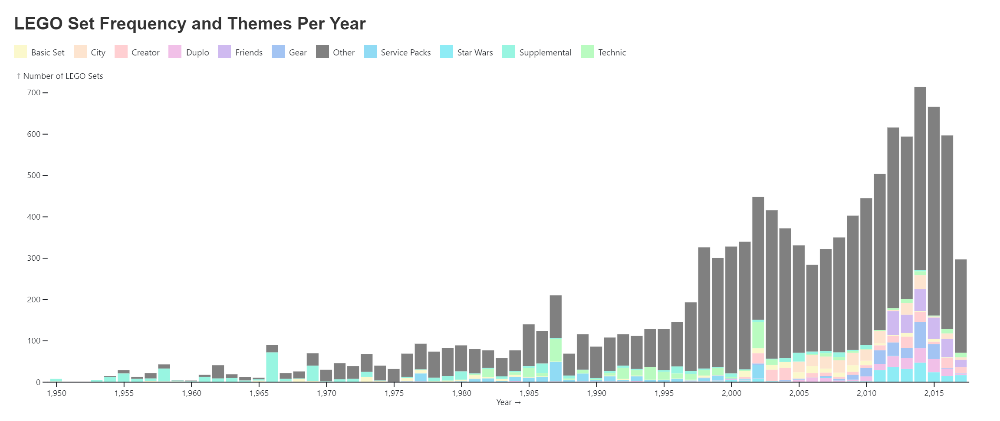

# LDW LEGO Visualization

This visualization aims to answer the question, "how do themes play a role in the number of LEGO sets released each year?" Specifically, because of the abundance of themes, the visualization depicts the 10 most frequent themes with all of the other themes grouped in an "Other" category. The visualization shows an upwards trend in the number of LEGO sets released each year in the time period of 1950 to July 2017. The themes are broken down by the colors within each and bar show similar rises and falls for most of the largest themes in accordance with the total number of sets released each year. While there is not a huge effect of the emergence of any particular theme over time, there are smaller trends and clear growth of different themes in different years.

Data Source: [Kaggle LEGO Database](https://www.kaggle.com/datasets/rtatman/lego-database)

***Note that the svg version of the visualization does not include the color legend and while it is provided here, it will be updated to match the png version that is correct.***

